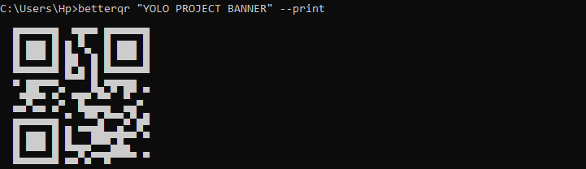

<div align="center">


---
[](https://www.python.org/)[](https://pypi.org/project/betterqr/)[](https://pypi.org/project/betterqr/)[](https://github.com/DevX-Dragon/betterqr/actions/workflows/ci.yml)[](https://hackatime.hackclub.com/my/projects/33.BetterQR)

</div>

# BetterQR

BetterQR is a powerful, pure-Python QR code generator that gives you complete creative control over your QR codes, all without external QR generation dependencies.

<div align="center">



</div>

## Try it out!

Ready to create beautiful QR codes? Get started with BetterQR today!

[**Install BetterQR now!**](#installation)

---

## What makes BetterQR special?

BetterQR isn't just another QR code generator; it's designed for flexibility and visual appeal. Here's what you can do:

- **Multiple Designs:** Go beyond basic squares with custom module shapes like circles, rounded corners, diamonds, and stars.

- **Vibrant Visuals:** Apply horizontal, vertical, diagonal, or radial gradients to your QR codes for a unique look.

- **Logo Embedding:** Seamlessly embed your logo with adjustable ratios, shapes (square, rounded, circle), and optional borders.

- **Animated Codes:** Bring your QR codes to life with 10 distinct GIF animation effects, including shimmer, fade, scan, and matrix.

- **Pretty Frames:** Add stylish frames and labels above or below your QR codes. Perfect for review QR codes or payment
QR codes

- **Micro QR Support:** Generate compact Micro QR codes (M1-M4) for smaller data payloads. Perfect for product labelling and other small data storing

- **Smart Data Helpers:** Easily create QR codes for WiFi networks, vCards, MeCards, GeoLocations, SMS, Email, Phone numbers, and even Crypto addresses.

- **Versatile Output:** Export your creations in PNG, JPG, PDF, SVG, or GIF formats.

- **Command-Line Interface (CLI):** Utilize a full-featured command-line interface for quick generation and scripting.

---

## Installation

Getting started with BetterQR is very easy. Simply install it using pip:

```bash
pip install betterqr --upgrade
```

---

## Why Choose BetterQR?

 Here's how BetterQR stands out against other popular Python QR libraries:

| Feature | BetterQR | `qrcode` | `segno` |
| --- | --- | --- | --- |
| Zero external QR-gen dependencies | ✅ | ✅ | ✅ |
| Module shapes (circle, star, diamond, etc.) | ✅ | ❌ | ❌ |
| Gradients | ✅ | ❌ | ❌ |
| Logo embedding | ✅ | Manual (Pillow) | ❌ |
| Frames & labels | ✅ | ❌ | ❌ |
| Animated GIF output | ✅ | ❌ | ❌ |
| Micro QR (M1–M4) | ✅ | ❌ | ✅ |
| WiFi / vCard / MeCard / SMS / Email / Phone helpers | ✅ | ❌ | Partial |
| CLI included | ✅ | ✅ | ✅ |
| SVG / PDF / EPS output | ✅ | SVG only | ✅ |

---

## Quick Start

Here are a few ways to quickly generate QR codes with BetterQR:

### Command Line Interface (CLI)

```bash
# Basic QR code
betterqr "https://example.com" my_qr.png

# Micro QR (automatically selects the smallest version )
betterqr "HELLO" --type micro micro.png

# Styled with a radial gradient
betterqr "Hello" my_qr.png --gradient "#FF6B6B" "#4ECDC4" --gradient-dir radial

# With a logo (remember to use ECC H for best results with logos)
betterqr "https://mysite.com" qr.png --logo logo.png --logo-ratio 0.3 --logo-shape rounded -e H

# Animated GIF with a matrix effect
betterqr "Animated QR" animated.gif --effect matrix --fps 12

# WiFi connection QR
betterqr --wifi MySSID MyPassword output.png

# Contact information QR
betterqr --contact "Jane Doe" --phone "+1-555-1234" --email "jane@example.com" contact.png
```

### Python API

```python
from betterqr import QR, WiFi, VCard, GeoLocation, SMS, Email, Phone

# Basic QR code
QR("https://example.com" ).save("qr.png")

# Micro QR — demonstrating different versions
QR("1234",        qr_type="micro", version=1, ecc="M").save("m1.png")  # numeric only
QR("HELLO WORLD", qr_type="micro", version=3, ecc="M").save("m3.png")  # alphanumeric
QR("Hello!",      qr_type="micro", version=4, ecc="L").save("m4.png")  # byte mode

# Styling with custom shapes and colors
(QR("styled")
    .style(shape="circle", fill="#6C3082", back="#F3E8FF")
    .save("styled.png"))

# 3-character hex codes also work
QR("x").style(fill="#000", back="#FFF").save("mono.png")

# Applying a radial gradient
QR("gradient").gradient("#FF6B6B", "#4ECDC4", direction="radial").save("grad.png")

# Embedding a logo with a rounded shape and border
(QR("https://mysite.com", ecc="H" )
    .logo("logo.png", ratio=0.25, shape="rounded", border=True)
    .save("logo.png"))

# Adding a fancy frame and a label
(QR("https://example.com" )
    .frame("fancy")
    .label("Scan Me!", position="below")
    .save("framed.png"))

# Creating an animated GIF
QR("Hello", ecc="H", version=4).animate("matrix", frames=30, fps=15).save("anim.gif")

# Using data helpers for common information types
QR(WiFi("MyNet", "MyPass", "WPA")).save("wifi.png")
QR(GeoLocation(51.5074, -0.1278)).save("geo.png")
QR(SMS("+15550199", "Hello!")).save("sms.png")
QR(Email("hi@example.com")).save("email.png")
QR(Phone("+18005550199")).save("phone.png")
QR(VCard("Jane Doe", phone="+15550199", email="jane@example.com")).save("vcard.png")
```

---

## Micro QR Capacities

Micro QR codes are a compact alternative for smaller data sets. Here's a breakdown of their capacities:

| Symbol | Size | Max Numeric | Max Alpha | Max Bytes |
| --- | --- | --- | --- | --- |
| M1/M | 11×11 | 5 | — | — |
| M2/L | 13×13 | 10 | 6 | — |
| M2/M | 13×13 | 8 | 5 | — |
| M3/L | 15×15 | 23 | 14 | 9 |
| M3/M | 15×15 | 18 | 11 | 7 |
| M4/L | 17×17 | 35 | 21 | 15 |
| M4/M | 17×17 | 30 | 18 | 13 |
| M4/Q | 17×17 | 21 | 13 | 9 |

> [!NOTE]
> Micro QR does not support ECC H. Use standard QR for logos.Micro QR cannot be scanned using normal phone cameras.

> [!TIP]
> Use a dedicated [Micro QR Scanner](https://www.dynamsoft.com/barcode-reader/barcode-types/micro-qr-code/) to test Micro QR codes.

---

## Documentation

For a more in-depth understanding of BetterQR's capabilities and API, please refer to the [**full documentation**](docs/DOCUMENTATION.md).

---

## Credits & Acknowledgements

BetterQR is a project by DevX-Dragon. I am grateful for the inspiration and support from the open-source community.

---

## License

BetterQR is registered under the MIT License. See the [**LICENSE**](LICENSE) file for more details.

